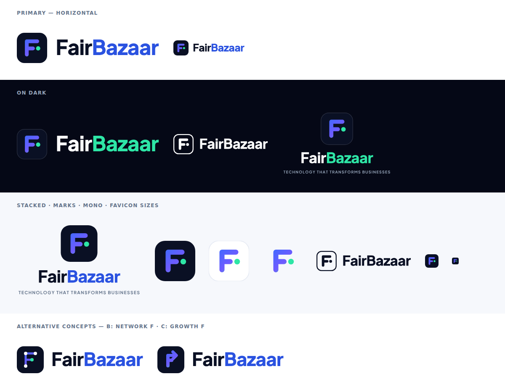

# FairBazaar Brand — Logo

## The mark: "Flow F"
An **F** whose middle stroke hands off to a live **data node** (mint dot): business operations flowing into connected, intelligent systems. The blue → violet → mint gradient reads as technology becoming growth. The rounded "app tile" badge signals a SaaS product company.

## Files (`/public/brand`)
| File | Use |
|---|---|
| `fairbazaar-logo.svg` | Primary horizontal logo on light backgrounds |
| `fairbazaar-logo-dark.svg` | Primary horizontal logo on dark backgrounds |
| `fairbazaar-logo-stacked.svg` / `-stacked-dark.svg` | Centred layouts, with tagline (posters, splash, documents) |
| `fairbazaar-mark.svg` | App icon, favicon, avatars |
| `fairbazaar-mark-light.svg` | Mark on white tile |
| `fairbazaar-glyph.svg` | Mark without the tile (watermarks, embossing) |
| `fairbazaar-logo-mono-black.svg` / `-mono-white.svg` | Single-colour print, stamps, engraving, fax |
| `fairbazaar-logo-1200.png` / `-dark-1200.png` | Documents, email signatures, presentations |
| `fairbazaar-mark-512.png`, `fairbazaar-social-avatar-800.png` | Google Business Profile, LinkedIn, social avatars |

Wordmark text is converted to outlines, so the SVGs render identically without the font installed.

## Colours
| Name | Hex |
|---|---|
| Ink (tile, "Fair" on light) | `#0A1024` |
| Fair Blue ("Bazaar" on light) | `#2A52E0` |
| Electric Blue (gradient start) | `#3D6BFF` |
| Violet (gradient mid) | `#6F5BFF` |
| Signal Mint (node, "Bazaar" on dark) | `#2EE6A6` |

**Typeface:** Plus Jakarta Sans ExtraBold for the wordmark and headings; Inter for body text.

## Rules
- Clear space: at least the height of the mint node × 4 on every side.
- Minimum size: horizontal logo 120 px wide; mark 16 px.
- Don't recolour the gradient, stretch, rotate, add shadows, or separate the node from the F.
- On photos, use the dark or mono-white version over a darkened area.
